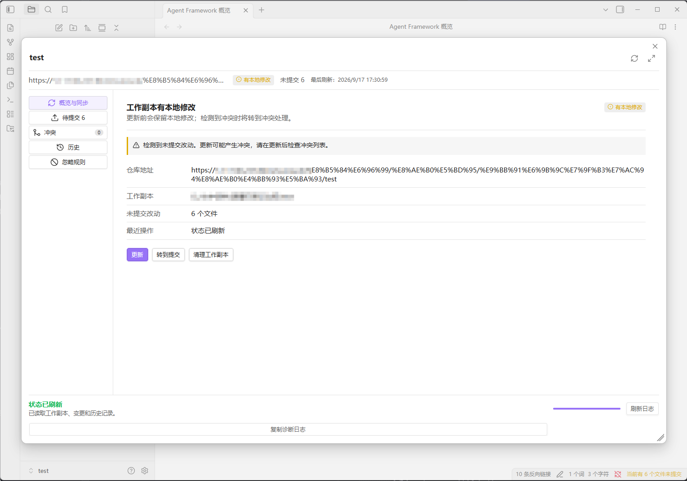

# 🧭 Obsidian SVN 同步控制中心

在 Obsidian 内查看和管理当前笔记库的 SVN 工作副本，减少在文件管理器和 SVN 客户端之间切换的操作。

> 当前版本仅支持 Windows 桌面版 Obsidian，并需要本机安装 SVN 命令行客户端（SVN CLI）。

## 🖥️ 界面预览



## ✨ 功能

- 自动检测本机 SVN 客户端，也支持手动选择 `svn.exe` 路径。
- 在 Obsidian 内执行更新、提交和工作副本清理。
- 查看新增、修改、删除、未版本化和冲突文件。
- 提供文本冲突的三栏合并界面。
- 查看 SVN 提交历史、文件历史和版本差异。
- 预览并恢复历史版本，恢复内容会作为新的本地修改。
- 管理 SVN 忽略规则，处理已纳入版本控制的文件时提供明确提示。
- 通过向导完成已有仓库 checkout，或将当前笔记库导入 SVN 后重新 checkout。

## 📋 环境要求

- Windows 桌面版 Obsidian。
- 已安装 SVN 命令行客户端，并可以在终端执行：

  ```bash
  svn --version --quiet
  ```

- Obsidian 版本不低于 `1.5.0`。

插件会依次尝试使用已配置的路径、系统 `PATH`，以及常见的 TortoiseSVN 和 SlikSVN 安装目录查找 `svn.exe`。如果自动检测失败，可以在插件设置中手动选择 SVN 安装目录或可执行文件。

## 📦 安装

当前版本适合通过 GitHub Release 手动安装：

1. 从 Release 下载插件文件。
2. 在目标 Vault 中创建目录：

   ```text
   .obsidian/plugins/svn-sync-control-center/
   ```

3. 将以下 3 个文件放入该目录：

   ```text
   main.js
   manifest.json
   styles.css
   ```

4. 重启 Obsidian，或在「设置 → 社区插件」中刷新插件列表。
5. 启用「SVN 同步控制中心」。

安装时不需要复制源码目录或 `node_modules` 目录。

## 🚀 首次使用

### 1. 配置 SVN 客户端

启用插件后，打开插件设置，确认已检测到 SVN 客户端。如果未检测到，请手动选择 `svn.exe`，然后执行版本验证。

### 2. 打开控制中心

可以点击左侧功能区中的 SVN 图标，也可以在 Obsidian 命令面板中执行「打开 SVN 控制中心」。

### 3. 根据当前笔记库选择操作

#### 当前 Vault 已经是 SVN 工作副本

插件会读取工作副本信息和文件状态。此时可以直接执行更新、提交、清理、历史查看和冲突处理。

#### SVN 仓库中已有笔记，但当前 Vault 不是工作副本

使用 checkout 向导，将仓库检出到新的或空的本地目录。checkout 完成后，请在 Obsidian 中打开这个新目录作为 Vault。

#### 想把当前本地笔记库纳入 SVN

请准备一个已经创建好的空 SVN 仓库，使用 import 向导导入当前内容。导入完成后，再将仓库 checkout 到新的本地目录，并在 Obsidian 中打开新的工作副本。

插件不会强行把非空 Vault 转换成 SVN 工作副本，也不会无提示覆盖已有文件。

## 🔧 常用操作说明

### 🔄 更新

更新前插件会检查本地修改。更新可能产生冲突，发现冲突后请进入「冲突」区域处理，并在确认结果正确后标记为已解决。

### 📤 提交

提交页面会列出当前变更文件。可以逐项选择文件，也可以全选。提交前请确认文件列表、提交说明和目标工作副本。

### ⚔️ 冲突合并

文本冲突支持在插件内比较本地版本、远端版本并编辑合并结果。二进制文件不提供内置合并器，需要使用外部工具处理。

### 🚫 忽略规则

插件提供常见 Obsidian 本地文件的默认忽略规则，例如工作区文件和回收站目录。已经受 SVN 版本控制的文件不能通过普通忽略规则隐藏；如需保留本地文件并从 SVN 移除，必须经过明确确认。

### 🕘 历史和恢复

恢复历史版本只会修改本地工作副本，不会改写 SVN 服务端历史。恢复后的内容需要通过普通提交创建新的 SVN 版本。

## 🔐 认证和数据安全

- 插件不会把 SVN 密码保存到插件设置中。
- 用户名和密码只在当前 SVN 命令执行期间使用。
- 后续认证复用由 SVN 客户端的本机认证缓存负责。
- 提交、更新、从版本控制移除文件和其他有潜在影响的操作需要用户确认。
- 插件直接调用本机 `svn.exe`，请确认设置中的可执行文件来自可信安装来源。
- 分享错误日志前，请检查并移除仓库地址、用户名、路径和其他敏感信息。

## ⚠️ 已知限制

- 仅支持 Windows 桌面版 Obsidian。
- 不支持 macOS、Linux 和移动端 Obsidian。
- 不负责创建或管理 SVN 服务端仓库、用户和权限。
- 暂不支持分支创建与切换、标签、锁定管理等高级 SVN 功能。
- 不提供二进制文件的内置冲突合并界面。
- 当前版本需要用户自行安装并维护本机 SVN 客户端。

## ❓ 常见问题

### 🔍 为什么插件检测不到 SVN？

请先在终端执行 `svn --version --quiet`。如果命令不可用，请安装 SVN 命令行客户端，或在插件设置中手动选择正确的 `svn.exe`。

### 📁 为什么当前 Vault 不能直接提交？

提交要求当前目录是 SVN 工作副本。如果当前 Vault 没有关联 SVN，请使用 checkout 或 import 向导完成关联，并按提示打开新的工作副本目录。

### ⚔️ 为什么更新后出现冲突？

当本地修改和远端修改涉及相同内容时，SVN 可能产生冲突。请先备份重要内容，再使用插件的冲突区域或外部工具完成合并。

### 📨 提交失败时应该提供什么信息？

请在 GitHub 仓库的 Issues 页面提交问题，并附上以下信息：

- Obsidian 版本。
- 插件版本。
- SVN 客户端版本。
- 操作类型，例如更新、提交或 checkout。
- 脱敏后的错误提示和诊断日志。

请不要直接上传包含密码、Token、完整私人仓库地址或个人目录的原始日志。

## 📄 许可证

本项目采用 GNU General Public License v3.0（GPL-3.0）授权，详见 [LICENSE](./LICENSE)。

基于本项目进行修改或再发布时，请遵循 GPL-3.0 的相关条款，并保留原有的许可证和版权声明。
